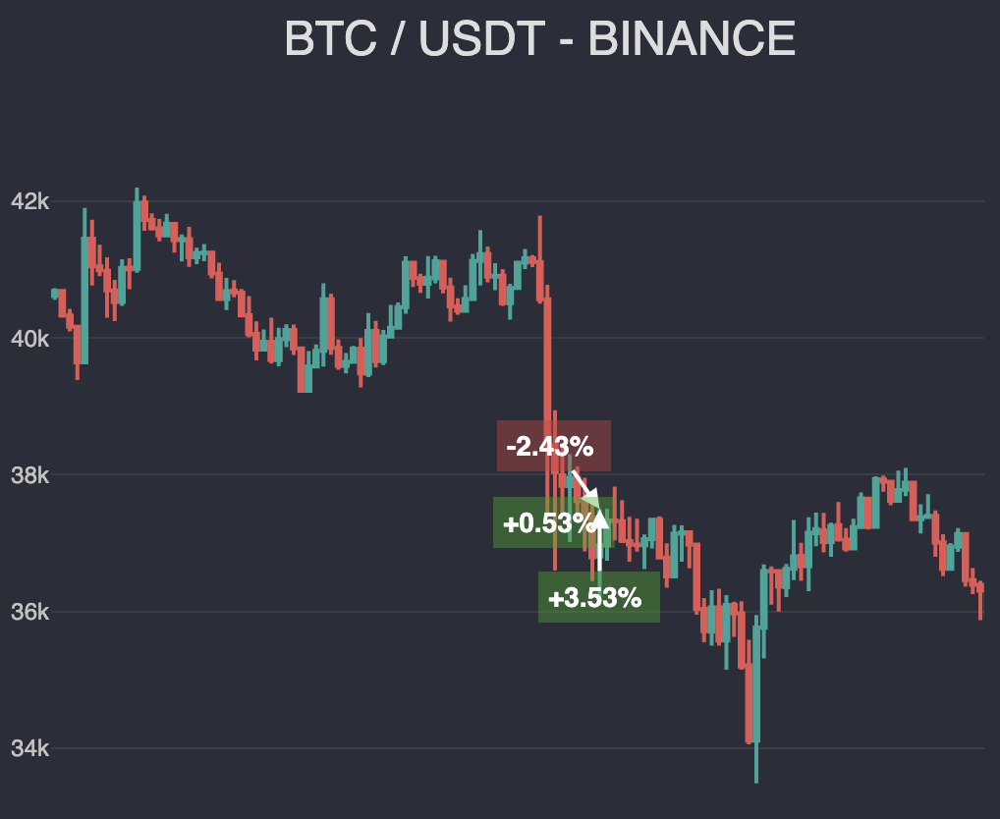
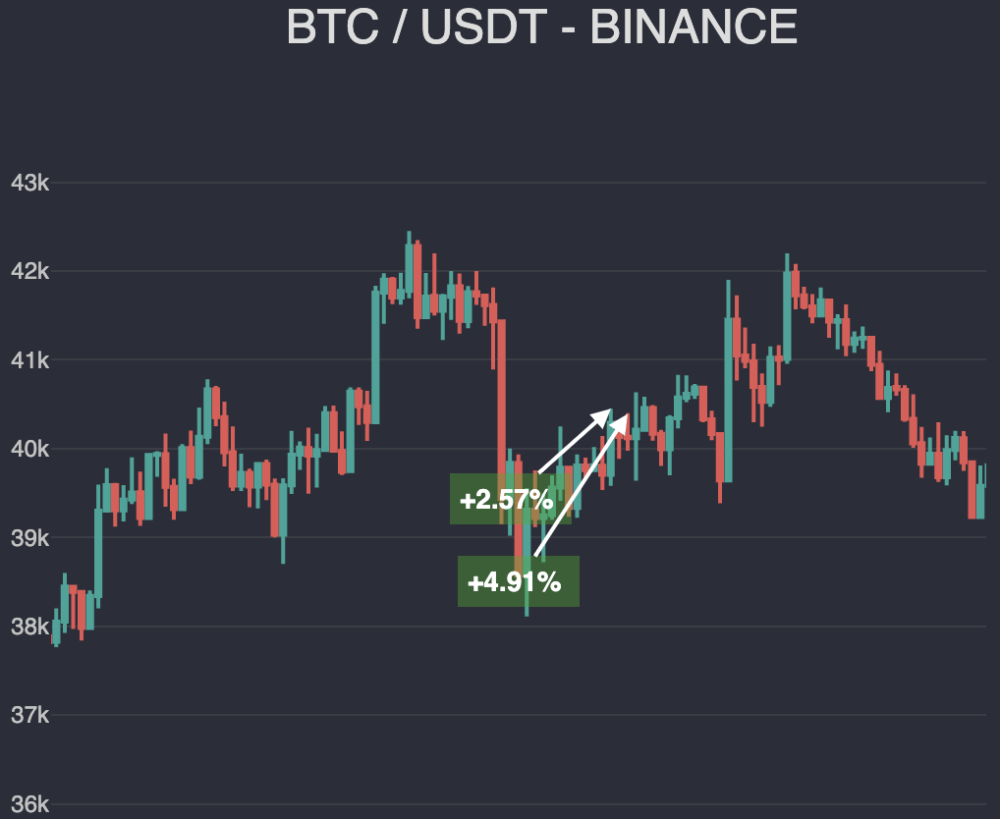

# @debut/plugin-dynamic-takes
Плагин Debut, для задания тейков и стопов в ручном режиме. Позволяет в любое время задать или изменить цены стоп и тейк для открытых позиций, используя их идентификатор. А также опционально осуществлять докупки, вместо закрытия убыточных позиций.

## Установка

```
npm install @debut/plugin-dynamic-takes --save
```

## Настройки

| Название | Тип | Значение по умолчанию | Описание   |
|-----------|------------|----------|------------|
| trailing  |  boolean | false | трейлинг стоп позиции после задания тейков и стопов |
| ignoreTicks  |  boolean | false | Игнорировать тики, тк часто бывает что стопы могут выбить тенью, но не телом свечи |
| maxRetryOrders  |  number | 0 | Устанавливает количество докупок * |

#### \* Докупки всегда того же обьема что и оригинальная позиция. Они выполняются при достижении стопа последней созданной сделкой. Уровни стопа будут копироваться из оригинальной сделки.

#### \*\* Если количество докупок не установлено, то позиция будет закыта при достижении стопа.
При достижении максимального количества докупок, система выставит тейки на уровень безубытка по всем сдекам, при этом если цена все же не развернется, закрываем все ранее созданые сделки в убыток.

## Задание тейков
```javascript
// в контексте Debut...
async onCandle({ c }) {
    // некоторые условия входа
    const order = await this.createOrder(target);
    let take = c + c * 0.15; // Допустим 15%
    let stop = c - c * 0.10; // А стоп 10%

    // Если сделка типа SELL, поменяем местами стоп и тейк
    if (target === OrderType.SELL) {
        [take, stop] = [stop, take];
    }

    // Зададим плагину цены, передав также orderId
    // Далее он будет осуществлять мониторинг достижения тейка или стопа
    // После которого автоматически закроет сделку
    this.plugins.dynamicTakes.setForOrder(order.orderId, take, stop);

    return order;
}
```

# Скриншоты (плагин [Report](../report/))

### Сделка с выводом в уровень безубытка


### Сделка с докупкой и прибылью

