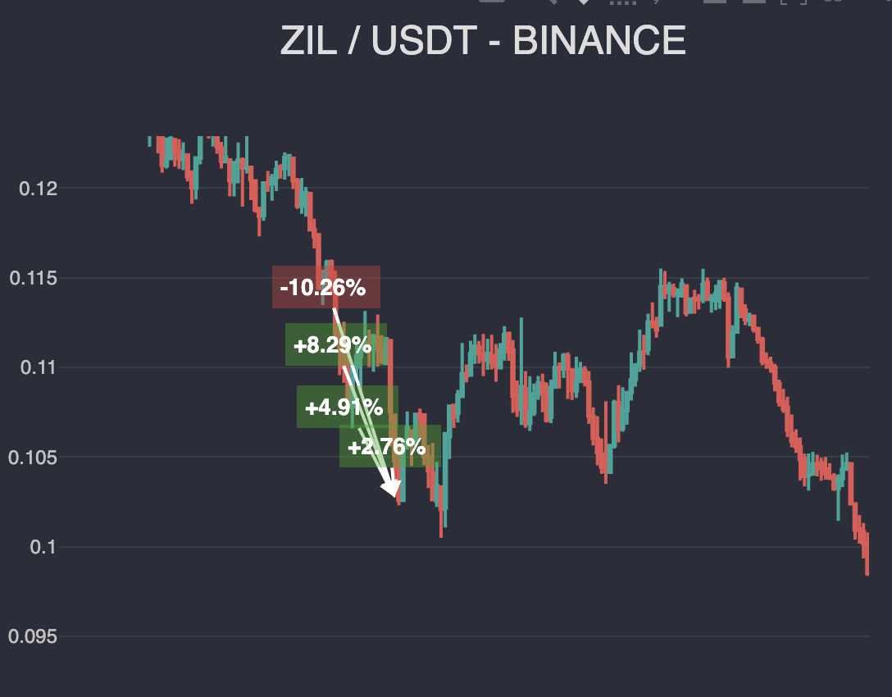
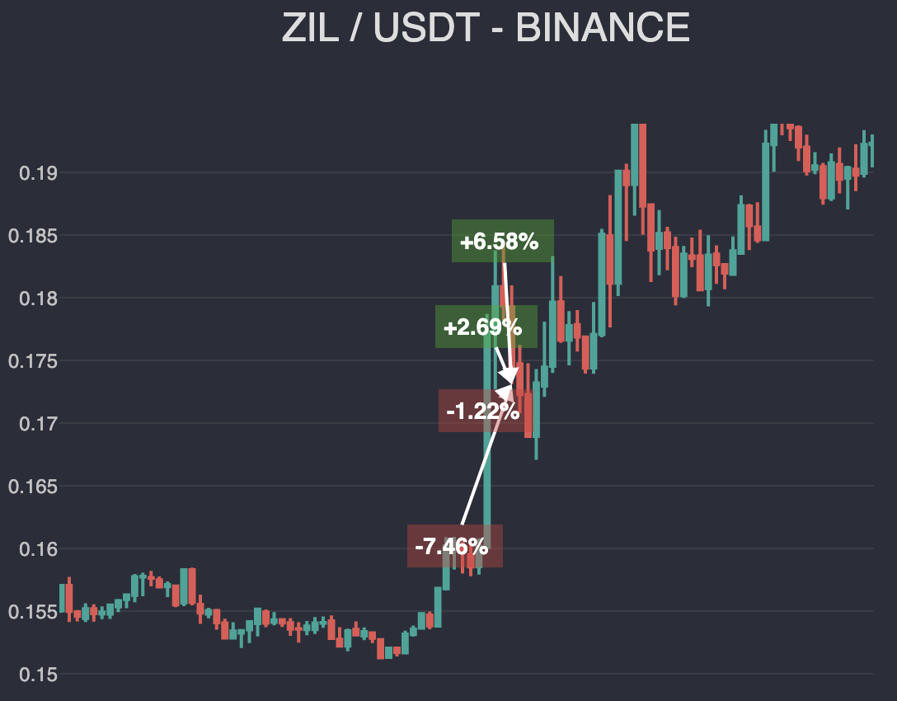

# @debut/plugin-grid
Плагин Debut, позволяет организовать работу двух видов стратегий на системах сеток. Трендовую "Ловушку" для цены, либо контр трендовую, систему докупок по мартингейлу, используя уровни сетки. Есть также возможность использовать фибоначчи дистанцию между уровнями.

## Установка

```
npm install @debut/plugin-grid --save
```

## Настройки

| Название | Тип | Описание   |
|-----------|----------|------------|
| step  |  number | Шаг сетки, значение в процентах. Шаг всегда одинаковый, если не активирована опция `fibo` |
| fibo  |  boolean | Расчет уровней по фибоначчи. Каждый следующий уровень сетки равен сумме двух предыдущих |
| martingale  |  number | Коэффициент мартингейла. Определяет количество лотов для сделки. В классической системе мартингейла равен 2, означает что всегда удваиваем лотность предыдущей сделки, в значении 1 - лот будет фиксированным |
| levelsCount  |  number | Количество уровней сетки, чем больше тем больше средств вам потребуется |
| takeProfit  |  number | Тейк профит в процентах. Считается как общая прибыль от открытых позиций по отношению к начальному капиталу |
| stopLoss  |  number | Стоп лосс в процентах. Считается по сумме всех открытых позиций, как и takeProfit * |
| reversed  |  boolean | При значении `false`, сетка работает по тренду, создавая сделки в направлении движения цены, в значении `true` против тренда, создавая сделки совпадающие со стартовой по направлению |

\* Стоп/Тейк работают не на основе цены, а на основе процента от средств.

## Инициализация плагина
```javascript
export interface MyStrategyOptinos extends DebutOptions, GridPluginOptions;

export class MyStrategy extends Debut {
    constructor(transport: BaseTransport, opts: CCISolderGOptions) {
        super(transport, opts);

        this.registerPlugins([
            // ...
            gridPlugin(this.opts),
            // ...
        ]);
    }
```

## Скриншоты (плагин [Report](../report/))

"Ловушка" для цены           |  Торговля против тренда по сетке сделок
:------------------------------------------------------------------:|:-------------------------------------------------------------------------:
  |  
