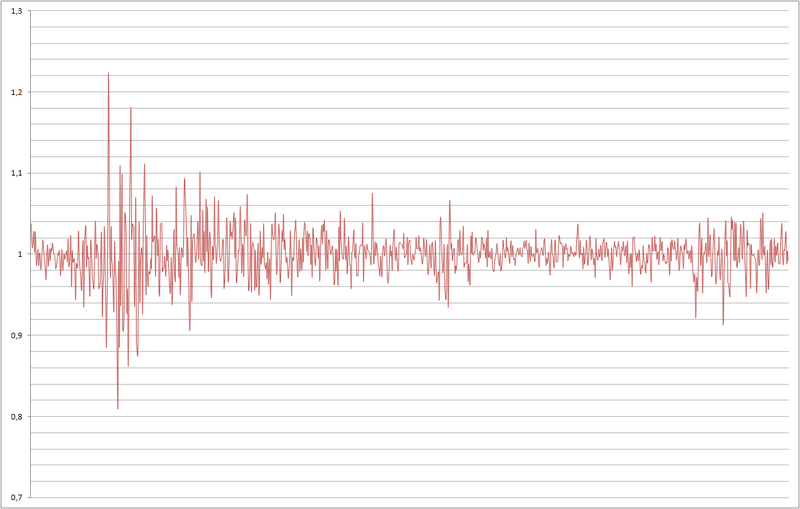
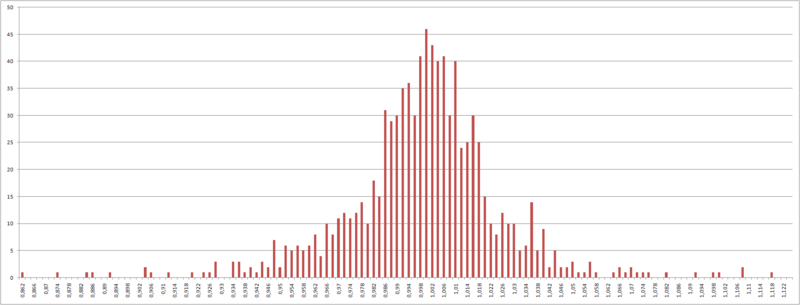
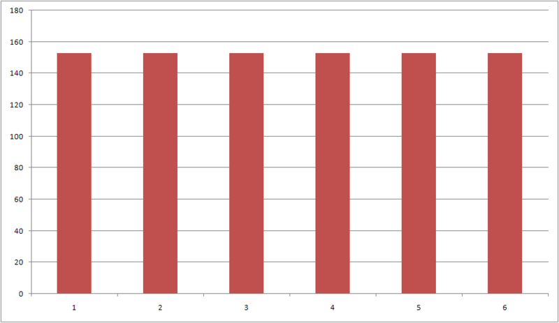
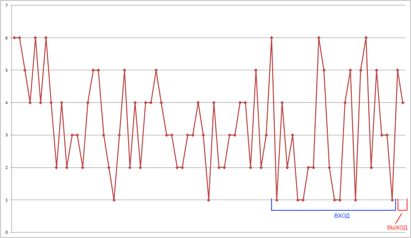

# @debut/plugin-neuro-vision


Debut plugin, allows you to train a neural network on historical data. Use it to filter trades as well as to directly predict price direction. Forecasting is based on the algorithm of price change clustering, in which each price change for a time period is proportional to the price for the previous time period. Such changes are clustered in a Gaussian distribution, creating a uniform pattern for the neural network to work and train. In other words, each candlestick falls into a finite number of groups (from 5 to 11) and then the next candlestick, or rather the group it will be adjacent to, is predicted.

## Install

```
npm install @debut/plugin-neuro-vision --save
```

## Settings

| Name | Type | Description |
|-----------|----------|------------|
| inputSize | number | window size (input) for training and using the neural network (input size) |
| outputSize | number | forecast candles count |
| segmentsCount | boolean | number of segments into which the Gaussian distribution will be divided |
| precision | number | number of decimal places when rounding (Affects the distribution) |
| hiddenLayers? | number | optionally, number of hidden layers, default [32, 16] |
| debug? | boolean | Optional, enables output of Gaussian segments, for equal division debug* |

* Segments must contain equal number of elements (count should be about the same)
## Plugin API
| Method | Description |
|-----------|------------|
| addInput | Add input for activation. Use after model has been trained, before forcast() call |
| momentForecast | Forecast for current non closed candle |
| forecast | Forecast for fully closed candle |
| addTrainValue | Add a candle to the training sample (use only with `--neuroTrain`) |
| restore | Number of decimal places, when rounding (Affects the distribution) |
| isTraining | Returns the training flag, when `--neuroTrain` is true, otherwise false |
## Initialize plugin
```javascript
import { neuroVisionPlugin, NeuroVisionPluginAPI } from '@debut/plugin-neuro-vision';

// ...
export interface MyStrategyOptions extends DebutOptions, NeuroVisionPluginOptions;

export class MyStrategy extends Debut {
    declare plugins: NeuroVisionPluginAPI;
    private neuroTraining = false;

    constructor(transport: BaseTransport, opts: MyStrategyOptions) {
        super(transport, opts);

        this.registerPlugins([
            // ...
            neuroVisionPlugin({ windowSize: 25, segmentsCount: 11, precision: 6 }),
            // or
            // neuroVisionPlugin(opts),
            // ...
        ]);

        this.neuroTraining = this.plugins.neuroVision.isTraining();

        if (!this.neuroTraining) {
            this.plugins.neuroVision.restore();
        }
    }
```

```javascript
//...
 async onCandle(candle: Candle) {
     // training
    if (this.neuroTraining) {
        This.plugins.neuroVision.addTrainValue(candle);
        return;
    }

    // usage
    this.plugins.neuroVision.addInput(candle);
    this.neuroVision = this.plugins.neuroVision.forecast(candle);
    console.log(this.neuroVision);
    /// output: [{ low: predicted low price, high: predicted high price, avg: average predicted price }]
    /// example: [{ low: 22564.3, high: 22693.7, avg:  22620.15 }]
 }
```
## Neural network training

For training, use the standard Debut testing mechanism.
Add the `--neuroTrain` flag to train the neural network. Don't forget to set `gap` so that you can test on untrained data.
The training data will be automatically saved at the end of the process. In the trading strategy directory in `rc`. When you use and call the `restore` method, the network will be recreated from the saved data.

```bash
npm run compile && npm run testing -- --bot=Name --ticker=ETHUSDT --days=600 --gap=60 --neuroTrain
```

## Algorithm
Really significant for the predictions are the changes of quotes. Therefore, the input of the neural network after preprocessing will be a series of percentage increments of quotes, calculated by the formula X[t] / X[t-1], where X[t] and X[t-1] are closing prices of periods.

<p>
</br>
Figure 1 - Series of percentage increments of quotes calculated using the formula X[t] / X[t-1].
</p>

Initially, the percentage increments have a Gaussian distribution, and of all statistical distribution functions defined on the finite interval, the uniform distribution has maximum entropy, so we recode the input variables to ensure that all examples in the training sample carry approximately the same information load.

<p>
</br>
Figure 2 - Distribution of percentage increments of quotes.
</p>

In order to create different groups, which candlesticks will have equal probability to get into, the segment from the minimal percentage increment to the maximal one is divided into N segments, so each segment contains the equal amount of percentage increments of quotes in its value range. Each segment will be a group, the leftmost group - the falling price, the center - the neutral zone, the end - the zone of active price growth.

<p>
</br>
Fig. 3 - Uniform distribution. On the vertical the number of candles in the group, on the horizontal the number of the group.
</p>

The task of reception of input images for forming the training set in tasks of forecasting of time series assumes using of "window" method. This method implies the use of a "window" with a fixed size, capable of moving through the time sequence of historical data, starting from the first element, and designed to access the data of time series, and the "window" of size N, after receiving such data, sends the elements from 1 to N-1 to the input of the neural network, and the N-th element is used as the output. The window method is used not only for training, but also for prediction. The number of elements in the window is the same as the number of input nodes in the neural network.

<p>
</br>
Figure 4 - Window method.
</p>

The higher the quality of the training sample, the less inconsistent and more repeatable it is. For the forecasting tasks of financial time series, the high discrepancy of a training sample is the sign of unsuccessful choice of the description method
