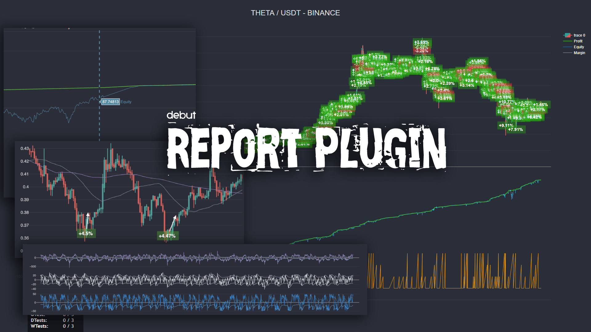

# @debut/plugin-report

<p align="center"></p>

Плагин Debut, для задания тейков и стопов в ручном режиме. Позволяет в любое время задать или изменить цены стоп и тейк для открытых позиций, используя их идентификатор. А также опционально осуществлять докупки, вместо закрытия убыточных позиций.
По умолчанию плагинт отрисовывает изменения баланса, а также использованую маржу (если у стратегии одновременно создается больше чем 1 сделка). Имеет некоторые API для настройки.

## Установка

```
npm install @debut/plugin-report --save
```

## Настройки

### Создание индикаторов
При инициализации плагину можно передать массив данных для построения графика индикаторов.  Для этого нужно создать метод, например `getIndicators` который вернет схему построения индикаторов [`IndicatorsSchema`](https://github.com/debut-js/Plugins/tree/master/packages/report#%D0%BE%D0%BF%D0%B8%D1%81%D0%B0%D0%BD%D0%B8%D0%B5-%D1%81%D1%85%D0%B5%D0%BC%D1%8B-%D0%B8%D0%BD%D0%B4%D0%B8%D0%BA%D0%B0%D1%82%D0%BE%D1%80%D0%B0-indicator)

```javascript
import { ReportPluginAPI, IndicatorsSchema } from '@debut/plugin-report';
// ...

// В контексте Debut
public getIndicators = (): IndicatorsSchema => {
    return [{
        // Имя индикатора
        name: 'cci',
        // Массив линий
        lines: [{
            name: 'cci',
            getValue: () => {
                return this.cciValue;
            },
        }],
        // Уровни
        levels: [-100, 100],
    }];
```

### Инициализация плагина

В метод `create` в мета файле стратегии добавьте для инциализации в окружении `tester`

```javascript
// ...
async create(transport: BaseTransport, cfg: MyStrategyNameOptions, env: WorkingEnv) {
    const bot = new MyStrategyName(transport, cfg);
    // ...
    // Специфичные плагины окружения
    if (env === WorkingEnv.tester) {
        // Регистрация плагина
        bot.registerPlugins([reportPlugin()]);

        // Установки индикаторов
        bot.plugins.report.addIndicators(bot.getIndicators());
    }

    // ...
    return bot;
},
```

### Веб сервер для просмотра статистики
Сервер запускается командой `npm run serve` для этого добавьте в раздел `scripts` в файле package.json соответствущую команду.

```json
...
"scripts": {
    "serve": "report-serve",
    ...
```

### Описание схемы индикатора `Indicator`

| Название  | Тип        | Описание   |
|-----------|------------|------------|
name | string | Имя группы кривых, не отображается на графике, служит для создания и хранения служебной информации о индикаторе.
figures | Array<{ name: string; getValue: () => number; fill: boolean; type: FigureType; }> | Массив линий, поле `name` - описывает название линии на графике, метод `getValue` - возвращает актуальное значение индикатора на данный момент времени, `fill` - позволяет выполнить заливку зоны линии к оси Y, `FigureType` поддерживает типы линия и bar.
levels | number[] | Массив чисел, для отрисовки постоянных линий уровней на графике
inChart | boolean | Способ размещения индикатора. Если `true` индикатор будет рисоваться на свечном графике, поверх свеч. Если `false`, то индикатор рисуется отдельно от графика цен. Например индикаторы _SMA_ или _Bollinger Bands_ - разумно рисовать в режиме `inChart: true`

### Описание API
Все API доступно через вызов `this.plugins.report.имя_метода`, подробнее о работе API можно прочитать в документации.

| Название метода        | Описание   |
|------------------------|------------|
addIndicators | Позволяет передать схему построения индикаторов, вызывается один раз при инциализации плагина
disableProfitPlot | При вызове выключает отрисовку прибыли на графике. В основном используется для удобства, при нехвате места на графике для отрисовки индикаторов или свеч.
setXRange | Задание диапазона значений для оси X, позволяет отрезать начало и конец.
disableOrdersDisplay | При вызове отключает визуализацию сделок
setManualOrder | Позволяет отрисовать на графике любую сделку в ручном режиме, с помощью переданных параметров цен и времени.
addOpenTarget | Позволяет создать на графике только точку открытия сделки в ручном режиме
resetOrders | Очистить сделки на графике

### Пример MACD индикатор

```javascript
public getIndicators = (): IndicatorsSchema => {
    return [
        {
            name: 'MACD Indicator',
            figures: [
                {
                    name: 'signal',
                    fill: FillType.tozeroy,
                    getValue: () => {
                        return this.macdValue.signal;
                    },
                },
                {
                    name: 'macd',
                    fill: FillType.tozeroy,
                    getValue: () => {
                        return this.macdValue.macd;
                    },
                },
                {
                    name: 'histogram',
                    type: FigureType.bar,
                    getValue: () => {
                        return this.macdValue.histogram;
                    },
                },
            ],
        },
    ];
};
```
